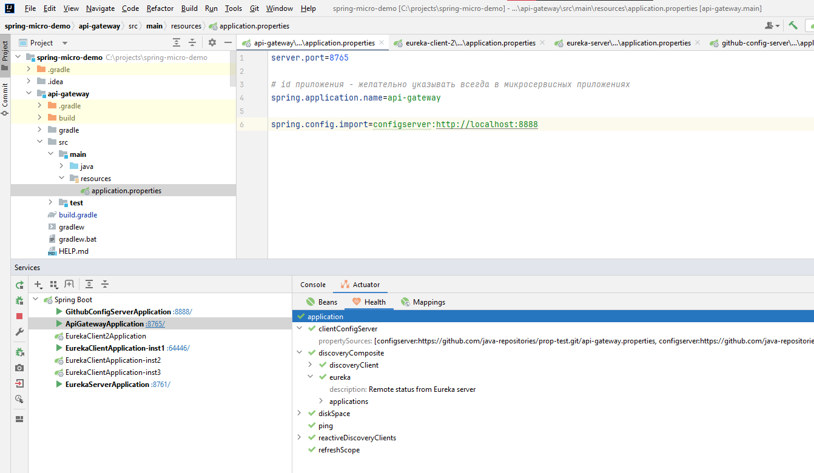

# Spring Microservices Demo

## Useful links

- eureka http://localhost:8761/
- api gateway (built-in load balancer) http://localhost:8765
- http://localhost:8765/eclient/main/test <=> http://localhost:8765/main/test
- http://localhost:8765/eclient2/new/name <=> http://localhost:8765/new/name
- настройки eureka-client http://localhost:8888/eureka-client/default

## Для **config server**

- application.properties - считают все
- application-micro.properties - считают, кому нужен профайл micro
- api-gateway.properties - конкретный сервис
- eureka-server.properties - конкретный сервис

## Актуатор

<details>
  <summary>Скриншоты</summary>



</details>
 
## Docker

Docker version 27.2.0, build 3ab4256

Нужно использовать host.docker.internal вместо localhost.

```bash
gradle :build

docker build -f github-config-server/Dockerfile -t demo/github-config-server:1.0.0 .
docker build -f eureka-server/Dockerfile -t demo/eureka-server:1.0.0 .
docker build -f eureka-client/Dockerfile -t demo/eureka-client:1.0.0 .
docker build -f eureka-client-2/Dockerfile -t demo/eureka-client-2:1.0.0 .
docker build -f api-gateway/Dockerfile -t demo/api-gateway:1.0.0 .

docker compose up

```